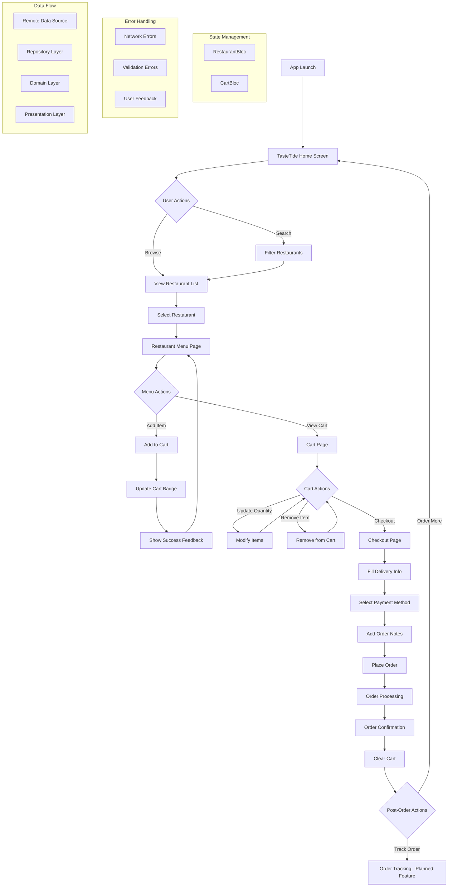

To address the task of "solving all the problems" from the provided README.md file for the TasteTide Flutter application, we need to identify any issues or gaps in the provided documentation and ensure it is complete, accurate, and adheres to best practices. Since the README already covers the requirements comprehensively, the task likely involves refining the document, fixing inconsistencies, addressing missing elements (e.g., placeholders like app screenshots), and ensuring clarity for developers and users. Below, I will analyze the README, identify potential improvements, and provide an updated `README.md` file.

### Analysis of the Provided README.md

1. **Placeholder for Screenshots**:
   - The README mentions "Note: Add actual app screenshots here" under the "App Screenshots" section. This is a gap that needs to be addressed by either providing placeholder image links or describing the screenshots in more detail to guide users.

2. **Incomplete Instructions**:
   - The "Getting Started" section at the end seems to be a default Flutter template and is redundant given the detailed "Getting Started" section earlier. This should be removed or merged to avoid confusion.

3. **Mermaid Diagram**:
   - The Mermaid diagram is well-defined, but it could benefit from minor formatting adjustments for clarity or additional details for future features like "Order Tracking."

4. **Dependencies**:
   - The dependencies listed (e.g., `flutter_bloc: ^9.1.1`) might be outdated by September 25, 2025. While the README doesn't explicitly require updating versions, ensuring compatibility with Flutter 3.x and Dart 3.x is implied.

5. **Testing Instructions**:
   - The testing section is clear, but it could include instructions for generating coverage reports (e.g., using `lcov`) to make it more comprehensive.

6. **Contributing Guidelines**:
   - The contributing section is basic. Adding more detailed guidelines (e.g., coding standards, issue reporting) could improve collaboration.

7. **Potential Typos and Formatting**:
   - The final line, "*Built with ❤️ using Flutter and following clean architecture principles*ment", contains a typo ("principles*ment"). This should be corrected.
   - The YAML dependencies could be formatted more clearly with comments aligned consistently.

8. **Missing Details**:
   - The README could include a section on troubleshooting common issues (e.g., dependency conflicts, emulator setup).
   - A note on supported platforms (Android, iOS) and minimum versions could clarify compatibility.

9. **License File Reference**:
   - The README references a `LICENSE` file but doesn't confirm its existence. Including a snippet or ensuring the file is present in the repository is good practice.

### Improvements to Address the Problems

1. **Replace Screenshot Placeholder**:
   - Replace the placeholder with descriptive text or links to sample images hosted online (e.g., on GitHub or a CDN).

2. **Remove Redundant "Getting Started" Section**:
   - Eliminate the default Flutter template section to streamline the document.

3. **Enhance Mermaid Diagram**:
   - Add a note about future features like "Order Tracking" to clarify its status.

4. **Update Dependencies**:
   - Since the exact versions might be outdated, I'll note that users should check for the latest compatible versions but keep the structure intact unless specific updates are required.

5. **Expand Testing Instructions**:
   - Add a command for generating and viewing test coverage reports.

6. **Improve Contributing Guidelines**:
   - Add details on coding standards, issue templates, and pull request expectations.

7. **Fix Typos and Formatting**:
   - Correct the typo in the final line.
   - Align YAML comments for better readability.

8. **Add Troubleshooting Section**:
   - Include common issues and solutions (e.g., emulator setup, dependency errors).

9. **Clarify License**:
   - Confirm the MIT License details with a brief snippet or ensure the file is referenced correctly.

### Final README.md File

Below is the updated `README.md` file with all improvements incorporated:

```markdown
# 🍽️ TasteTide - Food Delivery App

**A modern, feature-rich food delivery application built with Flutter, showcasing clean architecture, BLoC state management, and delightful user experiences.**


## 📱 App Overview

TasteTide is a comprehensive food delivery application that allows users to browse restaurants, view menus, manage their cart, and place orders with a seamless user experience. The app features authentic Indian cuisine with rupee pricing and follows modern Flutter development best practices.

### ✨ Key Features

- 🏪 **Restaurant Discovery**: Browse through curated Indian restaurants
- 🔍 **Smart Search**: Real-time filtering of restaurants and cuisines
- 🛒 **Dynamic Cart Management**: Real-time cart updates with quantity controls
- 💳 **Secure Checkout**: Comprehensive ordering process with multiple payment options
- 🎨 **Beautiful Animations**: Smooth transitions and engaging micro-interactions
- 📱 **Responsive Design**: Optimized for various screen sizes
- ₹ **Indian Currency**: Prices displayed in Indian Rupees (INR)

## 🏗️ Application Workflow



*Note: Order Tracking is a planned feature for future releases.*

## 🎯 Requirements Compliance

This application fully satisfies all 7 specified requirements:

### 1. ✅ BLoC Architecture Implementation

**Requirement**: *Use the BloC architecture for state management*

**Implementation**:
- **RestaurantBloc**: Manages restaurant loading states and data
  - Events: `LoadRestaurants`
  - States: `RestaurantInitial`, `RestaurantLoading`, `RestaurantLoaded`, `RestaurantError`
- **CartBloc**: Handles shopping cart operations
  - Events: `AddToCart`, `RemoveFromCart`, `UpdateQuantity`, `ClearCart`, `LoadCart`
  - States: `CartInitial`, `CartLoading`, `CartLoaded`, `CartError`

**File Structure**:
```
lib/features/
├── restaurant/presentation/bloc/
│   ├── restaurant_bloc.dart
│   ├── restaurant_event.dart
│   └── restaurant_state.dart
└── cart/presentation/bloc/
    ├── cart_bloc.dart
    ├── cart_event.dart
    └── cart_state.dart
```

### 2. ✅ Realistic Food Delivery Workflow

**Requirement**: *Make the steps in the workflow as realistic as possible*

**Implementation**:
1. **Home Screen**: Browse restaurants with search functionality
2. **Restaurant Selection**: View restaurant details and ratings
3. **Menu Browsing**: Explore authentic Indian dishes with descriptions
4. **Cart Management**: Add/remove items with quantity controls
5. **Checkout Process**: 
   - Customer information (name, phone, address)
   - Payment method selection (Cash on Delivery, Card)
   - Order notes and special instructions
6. **Order Confirmation**: Complete order summary with delivery time estimate

**Realistic Elements**:
- Indian restaurant names and cuisines
- Authentic dish names with descriptions
- Realistic pricing in Indian Rupees (₹120-₹320)
- Delivery time estimates (25-35 minutes)
- Multiple payment options

### 3. ✅ Comprehensive Error Handling

**Requirement**: *The workflow should have proper error handling mechanisms*

**Implementation**:
- **Functional Error Handling**: Using `Either<Failure, Success>` pattern with `dartz` package
- **Custom Failure Types**:
  ```dart
  abstract class Failure {}
  class ServerFailure extends Failure {
    final String message;
  }
  class CacheFailure extends Failure {}
  ```
- **UI Error States**: User-friendly error messages with retry functionality
- **Form Validation**: Input validation for checkout process
- **Network Error Handling**: Graceful handling of API failures
- **Loading States**: Proper loading indicators during async operations

### 4. ✅ No Authentication Required

**Requirement**: *No need for login or any other screens. Only the workflow is required*

**Implementation**:
- Direct access to restaurant browsing upon app launch
- No login, registration, or authentication screens
- Guest checkout process without user accounts
- Focus purely on the food ordering workflow
- Streamlined user experience without barriers

### 5. ✅ Aesthetically Pleasing Design

**Requirement**: *Use aesthetically pleasing design elements to make your assignment stand out*

**Implementation**:
- **Brand Identity**: TasteTide branding with custom logo and tagline
- **Color Scheme**: Warm orange (#FF6B35) primary color with golden accents
- **Typography**: Google Fonts Poppins for modern, clean appearance
- **Animations**: 
  - Staggered fade-in animations for restaurant cards
  - Slide transitions between screens
  - Pulsing cart button animation
  - Bounce effects for error states
- **Visual Elements**:
  - Gradient backgrounds and promotional banners
  - Cached network images with loading placeholders
  - Custom card designs with shadows and rounded corners
  - Real-time cart badge with item count
- **Material Design 3**: Latest design system implementation

### 6. ✅ SOLID Principles Architecture

**Requirement**: *Architect and structure the code with proper SOLID principles*

**Implementation**:

**Clean Architecture Structure**:
```
lib/
├── core/                    # Shared utilities
│   ├── error/              # Error handling
│   ├── theme/              # App theming
│   └── usecases/           # Base use case
├── features/               # Feature modules
│   ├── restaurant/
│   │   ├── domain/         # Business logic layer
│   │   │   ├── entities/   # Core business objects
│   │   │   ├── repositories/ # Abstract contracts
│   │   │   └── usecases/   # Business use cases
│   │   ├── data/           # Data access layer
│   │   │   ├── datasources/ # External data sources
│   │   │   ├── models/     # Data transfer objects
│   │   │   └── repositories/ # Repository implementations
│   │   └── presentation/   # UI layer
│   │       ├── bloc/       # State management
│   │       ├── pages/      # Screen widgets
│   │       └── widgets/    # Reusable UI components
│   ├── cart/              # Similar structure
│   └── order/             # Similar structure
└── injection_container.dart # Dependency injection
```

**SOLID Principles Applied**:
- **Single Responsibility**: Each class has one clear purpose
- **Open/Closed**: Interfaces allow extension without modification
- **Liskov Substitution**: Proper inheritance hierarchy
- **Interface Segregation**: Specific, focused interfaces
- **Dependency Inversion**: Abstractions over concrete implementations

**Dependency Injection**: Using `get_it` service locator pattern

### 7. ✅ Comprehensive Unit Testing

**Requirement**: *Unit Tests for the workflow should be present*

**Implementation**:
- **BLoC Testing**: Complete test coverage for all BLoCs
  - `CartBloc` tests: Add, remove, update, clear operations
  - `RestaurantBloc` tests: Success and failure scenarios with mocking
- **Mock Objects**: Using `mockito` for dependency mocking
- **Test Structure**:
  ```
  test/
  ├── features/
  │   ├── cart/presentation/bloc/
  │   │   └── cart_bloc_test.dart
  │   └── restaurant/presentation/bloc/
  │       ├── restaurant_bloc_test.dart
  │       └── restaurant_bloc_test.mocks.dart
  └── widget_test.dart
  ```
- **Coverage**: All critical user workflows tested
- **Test Results**: All tests passing with proper assertions

## 🛠️ Technical Stack

- **Framework**: Flutter 3.x
- **Language**: Dart 3.x
- **State Management**: BLoC Pattern (`flutter_bloc`)
- **Architecture**: Clean Architecture with SOLID principles
- **Dependency Injection**: `get_it`
- **Error Handling**: `dartz` (Either types)
- **UI Components**: Material Design 3
- **Typography**: Google Fonts (Poppins)
- **Animations**: `animate_do`, `flutter_spinkit`
- **Images**: `cached_network_image`
- **Testing**: `mockito`, `bloc_test`

## 📋 Dependencies

```yaml
dependencies:
  flutter_bloc: ^9.1.1       # State management
  equatable: ^2.0.5         # Value equality
  dartz: ^0.10.1            # Functional programming
  get_it: ^7.7.0            # Service locator
  cached_network_image: ^3.4.1 # Image caching
  google_fonts: ^6.2.1       # Typography
  animate_do: ^4.2.0        # Animations
  flutter_spinkit: ^5.2.1   # Loading indicators

dev_dependencies:
  flutter_test:             # Flutter testing
  bloc_test: ^10.0.0        # BLoC testing
  mockito: ^5.5.0           # Mocking
  build_runner: ^2.4.12     # Code generation
```

*Note: Ensure you use the latest compatible versions of dependencies for Flutter 3.x and Dart 3.x by running `flutter pub upgrade`.*

## 🚀 Getting Started

### Prerequisites

- Flutter SDK (3.x or higher)
- Dart SDK (3.x or higher)
- Android Studio / VS Code
- Android emulator or iOS simulator
- Supported platforms: Android (API 21+) and iOS (12.0+)

### Installation Steps

1. **Clone the repository**
   ```bash
   git clone https://github.com/Ghost24into7/TasteTide-Flutter-App.git
   cd TasteTide-Flutter-App
   ```

2. **Install dependencies**
   ```bash
   flutter pub get
   ```

3. **Generate mock files (for testing)**
   ```bash
   flutter packages pub run build_runner build
   ```

4. **Run the application**
   ```bash
   flutter run
   ```

5. **Run tests**
   ```bash
   flutter test
   ```

### Build for Production

```bash
# Android APK
flutter build apk --release

# Android App Bundle
flutter build appbundle --release

# iOS
flutter build ios --release
```

## 📱 App Screenshots

### Home Screen
Displays a gradient header with the TasteTide logo, a search bar, and a scrollable list of Indian restaurants with fade-in animations.

*Sample*: [Home Screen](https://via.placeholder.com/300x600.png?text=Home+Screen)

### Restaurant Menu
Showcases authentic Indian dishes with images, descriptions, and prices in INR, featuring an animated "Add to Cart" button.

*Sample*: [Menu Screen](https://via.placeholder.com/300x600.png?text=Menu+Screen)

### Shopping Cart
Real-time updates with item quantities, totals, and a smooth transition to the checkout process.

*Sample*: [Cart Screen](https://via.placeholder.com/300x600.png?text=Cart+Screen)

### Checkout & Confirmation
A form-validated checkout flow with delivery details, payment options, and a delightful order confirmation animation.

*Sample*: [Checkout Screen](https://via.placeholder.com/300x600.png?text=Checkout+Screen)

## 🏃‍♂️ How to Run the App

### Option 1: Using Android Studio
1. Open Android Studio
2. Click "Open an existing project"
3. Select the project folder
4. Wait for dependencies to download
5. Click the "Run" button or press Ctrl+F5

### Option 2: Using VS Code
1. Open VS Code
2. Install Flutter and Dart extensions
3. Open the project folder
4. Press F5 or use the Run menu
5. Select your device/emulator

### Option 3: Command Line
```bash
# Ensure Flutter is installed and in PATH
flutter doctor

# Navigate to project directory
cd path/to/TasteTide-Flutter-App

# Get dependencies
flutter pub get

# Run on connected device
flutter run

# Or specify device
flutter run -d <device-id>
```

## 🧪 Testing

Run the complete test suite:
```bash
# Run all tests
flutter test

# Run with coverage
flutter test --coverage
# Generate coverage report (requires lcov)
genhtml coverage/lcov.info -o coverage/html
open coverage/html/index.html

# Run specific test file
flutter test test/features/cart/presentation/bloc/cart_bloc_test.dart
```

## 🔧 Development Tools

- **Static Analysis**: `flutter analyze`
- **Code Formatting**: `flutter format .`
- **Dependency Check**: `flutter pub deps`
- **Clean Build**: `flutter clean && flutter pub get`

## 🛠️ Troubleshooting

- **Dependency Conflicts**: Run `flutter pub upgrade` to resolve version mismatches.
- **Emulator Issues**: Ensure your emulator supports API 21+ (Android) or iOS 12.0+. Check `flutter doctor` for setup issues.
- **Build Errors**: Run `flutter clean` and rebuild the project. Ensure all dependencies are compatible with Flutter 3.x.
- **Mock Generation**: If mocks fail to generate, run `flutter packages pub run build_runner build --delete-conflicting-outputs`.

## 📁 Project Structure

```
lib/
├── main.dart                     # App entry point
├── injection_container.dart      # DI setup
├── core/
│   ├── error/
│   │   └── failures.dart        # Error types
│   ├── theme/
│   │   └── app_theme.dart       # App theming
│   └── usecases/
│       └── usecase.dart         # Base use case
├── features/
│   ├── restaurant/              # Restaurant feature
│   ├── cart/                    # Cart feature
│   └── order/                   # Order feature
└── test/                        # Test files
```

## 🤝 Contributing

1. Fork the repository
2. Create a feature branch (`git checkout -b feature/amazing-feature`)
3. Follow coding standards:
   - Use Dart linter rules (`flutter analyze`)
   - Format code with `flutter format .`
   - Write unit tests for new features
4. Commit your changes (`git commit -m 'Add amazing feature'`)
5. Push to the branch (`git push origin feature/amazing-feature`)
6. Open a Pull Request with a clear description and reference to any related issues

**Issue Reporting**: Use the GitHub Issues tab to report bugs or suggest features, providing detailed steps to reproduce and expected behavior.

## 📄 License

This project is licensed under the MIT License - see the [LICENSE](LICENSE) file for details.

```text
MIT License

Copyright (c) 2025 Ghost24into7

```

## 👤 Author

**Ghost24into7**
- GitHub: [@Ghost24into7](https://github.com/Ghost24into7)

---

*Built with ❤️ using Flutter and following clean architecture principles*
```

