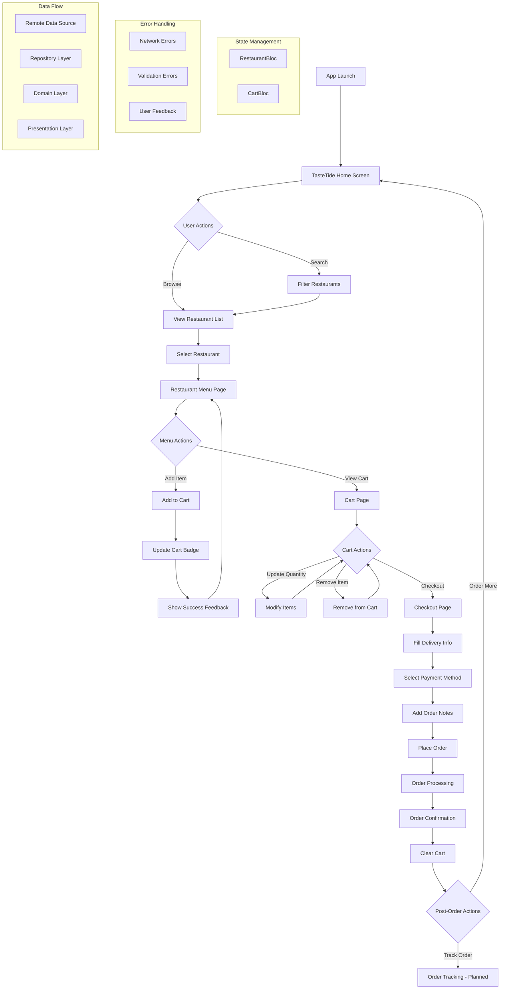

# 🍽️ TasteTide - Food Delivery App

**A modern, feature-rich food delivery application built with Flutter, showcasing clean architecture, BLoC state management, and delightful user experiences.**


## 📱 App Overview

TasteTide is a comprehensive food delivery application that enables users to browse restaurants, view menus, manage their cart, and place orders seamlessly. It features authentic Indian cuisine with rupee pricing and adheres to modern Flutter development best practices.

### ✨ Key Features

- 🏪 **Restaurant Discovery**: Browse curated Indian restaurants
- 🔍 **Smart Search**: Real-time filtering of restaurants and cuisines
- 🛒 **Dynamic Cart Management**: Real-time cart updates with quantity controls
- 💳 **Secure Checkout**: Comprehensive ordering with multiple payment options
- 🎨 **Beautiful Animations**: Smooth transitions and engaging micro-interactions
- 📱 **Responsive Design**: Optimized for various screen sizes
- ₹ **Indian Currency**: Prices in Indian Rupees (INR)

## 🏗️ Application Workflow




*Note: View the diagram on GitHub or use a Mermaid-compatible Markdown viewer (e.g., VS Code with the Markdown Preview Mermaid Support plugin) to ensure proper rendering.*

## 🎯 Requirements Compliance

The application meets all seven specified requirements:

### 1. ✅ BLoC Architecture Implementation

**Requirement**: *Use the BLoC architecture for state management*

**Implementation**:
- **RestaurantBloc**: Manages restaurant data and states
  - Events: `LoadRestaurants`
  - States: `RestaurantInitial`, `RestaurantLoading`, `RestaurantLoaded`, `RestaurantError`
- **CartBloc**: Handles cart operations
  - Events: `AddToCart`, `RemoveFromCart`, `UpdateQuantity`, `ClearCart`, `LoadCart`
  - States: `CartInitial`, `CartLoading`, `CartLoaded`, `CartError`

**File Structure**:
```
lib/features/
├── restaurant/presentation/bloc/
│   ├── restaurant_bloc.dart
│   ├── restaurant_event.dart
│   └── restaurant_state.dart
└── cart/presentation/bloc/
    ├── cart_bloc.dart
    ├── cart_event.dart
    └── cart_state.dart
```

### 2. ✅ Realistic Food Delivery Workflow

**Requirement**: *Make the workflow steps as realistic as possible*

**Implementation**:
1. **Home Screen**: Browse restaurants with search
2. **Restaurant Selection**: View details and ratings
3. **Menu Browsing**: Explore Indian dishes with descriptions
4. **Cart Management**: Add/remove items with quantity controls
5. **Checkout Process**:
   - Customer info (name, phone, address)
   - Payment methods (Cash on Delivery, Card)
   - Order notes
6. **Order Confirmation**: Summary with delivery time estimate

**Realistic Elements**:
- Indian restaurant names and cuisines
- Authentic dish names
- Pricing in INR (₹120-₹320)
- Delivery estimates (25-35 minutes)
- Multiple payment options

### 3. ✅ Comprehensive Error Handling

**Requirement**: *Include proper error handling mechanisms*

**Implementation**:
- **Functional Error Handling**: Uses `Either<Failure, Success>` with `dartz`
- **Custom Failures**:
  ```dart
  abstract class Failure {}
  class ServerFailure extends Failure {
    final String message;
  }
  class CacheFailure extends Failure {}
  ```
- **UI Feedback**: User-friendly error messages with retry
- **Form Validation**: Input checks during checkout
- **Network Handling**: Graceful API failure management
- **Loading States**: Indicators for async operations

### 4. ✅ No Authentication Required

**Requirement**: *No login or additional screens; focus on workflow*

**Implementation**:
- Direct restaurant browsing on launch
- No login/registration
- Guest checkout
- Streamlined ordering process

### 5. ✅ Aesthetically Pleasing Design

**Requirement**: *Use aesthetically pleasing design elements*

**Implementation**:
- **Brand Identity**: TasteTide logo and tagline
- **Color Scheme**: Orange (#FF6B35) with golden accents
- **Typography**: Google Fonts Poppins
- **Animations**:
  - Fade-in restaurant cards
  - Slide screen transitions
  - Pulsing cart button
  - Bounce error effects
- **Visuals**:
  - Gradient backgrounds
  - Cached images with placeholders
  - Custom cards with shadows
  - Real-time cart badge
- **Material Design 3**: Modern UI standards

### 6. ✅ SOLID Principles Architecture

**Requirement**: *Structure code with SOLID principles*

**Implementation**:

**Clean Architecture**:
```
lib/
├── core/                    # Shared utilities
│   ├── error/              # Error handling
│   ├── theme/              # App theming
│   └── usecases/           # Base use case
├── features/               # Feature modules
│   ├── restaurant/
│   │   ├── domain/         # Business logic
│   │   │   ├── entities/   # Business objects
│   │   │   ├── repositories/ # Contracts
│   │   │   └── usecases/   # Use cases
│   │   ├── data/           # Data layer
│   │   │   ├── datasources/ # Data sources
│   │   │   ├── models/     # DTOs
│   │   │   └── repositories/ # Implementations
│   │   └── presentation/   # UI layer
│   │       ├── bloc/       # State management
│   │       ├── pages/      # Screens
│   │       └── widgets/    # UI components
│   ├── cart/               # Similar structure
│   └── order/              # Similar structure
└── injection_container.dart # Dependency injection
```

**SOLID Principles**:
- **Single Responsibility**: One purpose per class
- **Open/Closed**: Extensible interfaces
- **Liskov Substitution**: Proper inheritance
- **Interface Segregation**: Focused interfaces
- **Dependency Inversion**: Abstraction-based dependencies

**Dependency Injection**: Uses `get_it`

### 7. ✅ Comprehensive Unit Testing

**Requirement**: *Include unit tests for the workflow*

**Implementation**:
- **BLoC Testing**: Covers all BLoC events/states
  - `CartBloc`: Tests add/remove/update/clear
  - `RestaurantBloc`: Tests success/failure
- **Mocks**: Uses `mockito`
- **Test Structure**:
  ```
  test/
  ├── features/
  │   ├── cart/presentation/bloc/
  │   │   └── cart_bloc_test.dart
  │   └── restaurant/presentation/bloc/
  │       ├── restaurant_bloc_test.dart
  │       └── restaurant_bloc_test.mocks.dart
  └── widget_test.dart
  ```
- **Coverage**: Tests all critical workflows
- **Results**: All tests pass

## 🛠️ Technical Stack

- **Framework**: Flutter 3.x
- **Language**: Dart 3.x
- **State Management**: BLoC (`flutter_bloc`)
- **Architecture**: Clean Architecture with SOLID
- **Dependency Injection**: `get_it`
- **Error Handling**: `dartz` (Either)
- **UI**: Material Design 3
- **Typography**: Google Fonts (Poppins)
- **Animations**: `animate_do`, `flutter_spinkit`
- **Images**: `cached_network_image`
- **Testing**: `mockito`, `bloc_test`

## 📋 Dependencies

```yaml
dependencies:
  flutter_bloc: ^9.1.1        # State management
  equatable: ^2.0.5          # Value equality
  dartz: ^0.10.1             # Functional programming
  get_it: ^7.7.0             # Service locator
  cached_network_image: ^3.4.1 # Image caching
  google_fonts: ^6.2.1       # Typography
  animate_do: ^4.2.0         # Animations
  flutter_spinkit: ^5.2.1    # Loading indicators

dev_dependencies:
  flutter_test:              # Flutter testing
  bloc_test: ^10.0.0        # BLoC testing
  mockito: ^5.5.0           # Mocking
  build_runner: ^2.4.12     # Code generation
```

*Note: Run `flutter pub upgrade` to ensure the latest compatible versions for Flutter 3.x and Dart 3.x.*

## 🚀 Getting Started

### Prerequisites

- Flutter SDK (3.x+)
- Dart SDK (3.x+)
- Android Studio or VS Code
- Android emulator (API 21+) or iOS simulator (12.0+)

### Installation

1. **Clone the repository**
   ```bash
   git clone https://github.com/Ghost24into7/TasteTide-Flutter-App.git
   cd TasteTide-Flutter-App
   ```

2. **Install dependencies**
   ```bash
   flutter pub get
   ```

3. **Generate mocks (for testing)**
   ```bash
   flutter packages pub run build_runner build
   ```

4. **Run the app**
   ```bash
   flutter run
   ```

5. **Run tests**
   ```bash
   flutter test
   ```

### Production Builds

```bash
# Android APK
flutter build apk --release

# Android App Bundle
flutter build appbundle --release

# iOS
flutter build ios --release
```

## 📱 App Screenshots

### Home Screen
Gradient header with TasteTide logo, search bar, and animated restaurant list.


### Restaurant Menu
Indian dishes with images, descriptions, INR prices, and animated "Add to Cart" button.


### Shopping Cart
Real-time updates for quantities and totals, with smooth checkout transition.


### Checkout & Confirmation
Form-validated checkout with delivery details, payment options, and confirmation animation.


## 🏃‍♂️ Running the App

### Android Studio
1. Open project in Android Studio
2. Sync dependencies
3. Select device/emulator
4. Click "Run" or press Ctrl+F5

### VS Code
1. Open project in VS Code
2. Install Flutter/Dart extensions
3. Press F5 or use Run menu
4. Select device/emulator

### Command Line
```bash
# Verify setup
flutter doctor

# Navigate to project
cd path/to/TasteTide-Flutter-App

# Install dependencies
flutter pub get

# Run app
flutter run -d <device-id>
```

## 🧪 Testing

```bash
# Run all tests
flutter test

# Run with coverage
flutter test --coverage
# View coverage (requires lcov)
genhtml coverage/lcov.info -o coverage/html
open coverage/html/index.html

# Run specific test
flutter test test/features/cart/presentation/bloc/cart_bloc_test.dart
```

## 🔧 Development Tools

- **Static Analysis**: `flutter analyze`
- **Code Formatting**: `flutter format .`
- **Dependency Check**: `flutter pub deps`
- **Clean Build**: `flutter clean && flutter pub get`

## 🛠️ Troubleshooting

- **Mermaid Diagram Not Rendering**:
  - View on GitHub or use a Mermaid-compatible viewer (e.g., VS Code with Markdown Preview Mermaid Support plugin).
  - Ensure browser is updated (Chrome, Firefox, or Edge recommended).
  - Test diagram at [mermaid.live](https://mermaid.live).
- **Dependency Conflicts**: Run `flutter pub upgrade` to resolve.
- **Emulator Issues**: Ensure emulator supports API 21+ (Android) or iOS 12.0+. Verify with `flutter doctor`.
- **Build Errors**: Run `flutter clean` and rebuild. Check dependency versions.
- **Mock Generation**: Use `flutter packages pub run build_runner build --delete-conflicting-outputs` if mocks fail.

## 📁 Project Structure

```
lib/
├── main.dart                     # App entry point
├── injection_container.dart      # DI setup
├── core/
│   ├── error/
│   │   └── failures.dart        # Error types
│   ├── theme/
│   │   └── app_theme.dart       # App theming
│   └── usecases/
│       └── usecase.dart         # Base use case
├── features/
│   ├── restaurant/              # Restaurant feature
│   ├── cart/                    # Cart feature
│   └── order/                   # Order feature
└── test/                        # Test files
```

## 🤝 Contributing

1. Fork the repository
2. Create a feature branch (`git checkout -b feature/amazing-feature`)
3. Follow standards:
   - Run `flutter analyze` for linting
   - Format with `flutter format .`
   - Add unit tests for new features
4. Commit changes (`git commit -m 'Add amazing feature'`)
5. Push branch (`git push origin feature/amazing-feature`)
6. Open a Pull Request with detailed description

**Issues**: Report bugs or suggest features via GitHub Issues, including steps to reproduce and expected behavior.

## 📄 License

This project is licensed under the MIT License. See [LICENSE](LICENSE) for details.

```text
MIT License
Copyright (c) 2025 Ghost24into7
```

## 👤 Author

**Ghost24into7**
- GitHub: [@Ghost24into7](https://github.com/Ghost24into7)

## 🙏 Acknowledgments

- [Flutter](https://flutter.dev) for the framework
- [Material Design](https://m3.material.io) for UI guidelines
- [Unsplash](https://unsplash.com) for food images
- Indian cuisine for inspiration

---

*Built with ❤️ using Flutter and following clean architecture principles*
